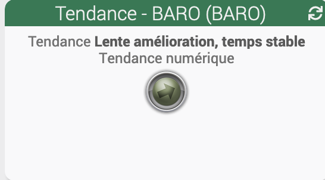
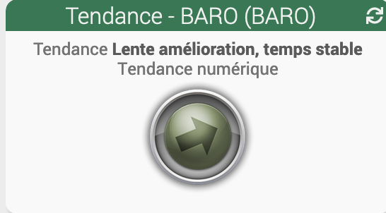
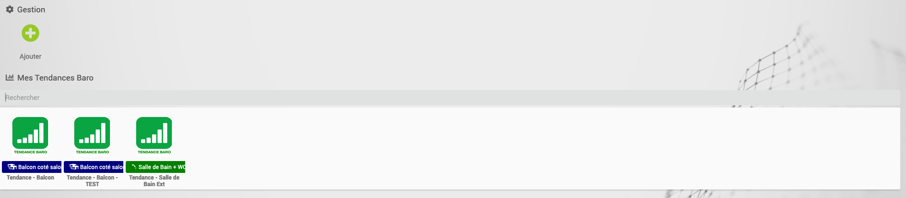
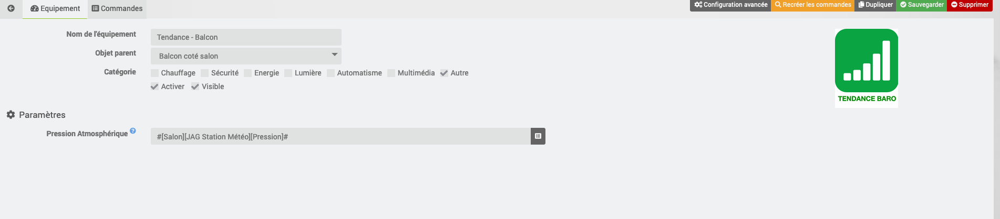
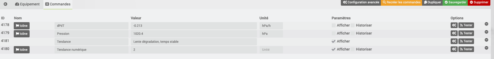

# Description

Ce plugin permet de calculer la tendance météo à venir en se basant sur les évolutions de la pression atmosphérique des dernières heures

# Configuration

Le plugin ne comporte pas de configuration générale.
Il faut ajouter un équipement pour la pression atmosphérique.

> Cet équipement doit avoir l'historique activé

# Configuration des équipements

La configuration des équipements virtuels est accessible à partir du
menu plugin :

# Tendance Météo

> Sources :
>
> - <a href="http://www.freescale.com/files/sensors/doc/app_note/AN3914.pdf">http://www.freescale.com/files/sensors/doc/app_note/AN3914.pdf</a>
> - <a href="https://www.parallax.com/sites/default/files/downloads/29124-Altimeter-Application-Note-501.pdf">https://www.parallax.com/sites/default/files/downloads/29124-Altimeter-Application-Note-501.pdf</a>

Le plugin calcule 6 niveaux d'information

|  Niveau  | Tendance                           |                          Image du widget                           |
| :------: | :--------------------------------- | :----------------------------------------------------------------: |
| <b>0</b> | Forte dégradation, instable        |  |
| <b>1</b> | Dégradation, mauvais temps durable |  |
| <b>2</b> | Lente dégradation, temps stable    |  |
| <b>3</b> | Lente amélioration, temps stable   |  |
| <b>4</b> | Amélioration, beau temps durable   |  |
| <b>5</b> | Forte embellie, instable           |  |

Le plugin met à disposition deux widgets pour la tendance :

> - Baro/Tendance (Icône 40x40) (Widget par défaut)

> - Baro/Tendance 80x80 (Icône 80x80)

# FAQ

- Est-ce que le plugin s'appuie sur des API tiers ?

  > Non, le plugin fait le calcul en interne par rapport à la pression atmosphérique

- A quoi sert le plugin ?

  > Le plugin calcule une tendance météo en se basant sur l'évolution de la pression atmosphérique sur les dernières heures

# Exemple de configuration

## Vue de la liste des équipements

## Exemple de configuration

# Troubleshotting

- Je n'ai pas d'informations qui remontent

  > Il faut bien indiquer l'équipement pression pour que le plugin fonctionne correctement. L'équipement doit être aussi historisé pour pouvoir fonctionner
  >
  > On peut rechercher les équipements grace au bouton de recherche de l’équipement.

- Le calcul de la tendance ne se fait pas
  > Il faut attendre 4h pour avoir des résultats corrects lors de la création de l'équipement
  > L'équipement doit être aussi historisé pour pouvoir fonctionner
