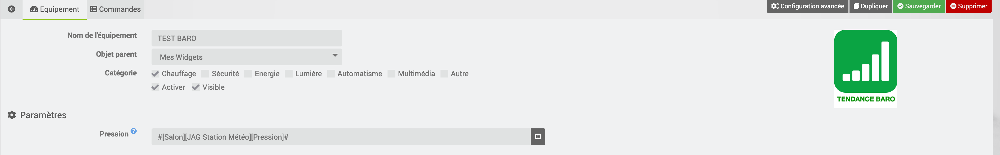

# Description

Ce plugin permet de calculer la tendance météo à venir en se basant sur les évolutions de la pression atmosphérique des dernières heures

# Configuration

Le plugin ne comporte pas de configuration générale.
Il faut ajouter un équipement pour la pression atmosphérique

# Configuration des équipements

La configuration des équipements virtuels est accessible à partir du
menu plugin :

# Exemple de configuration

Voici un exemple de configuration

# FAQ

-   **Est-ce que le plugin s'appuie sur des API tiers ?** : Non, le plugin fait le calcul en interne par rapport à la pression atmosphérique

-   **A quoi sert le plugin ?** : Le plugin calcule une tendance météo en se basant sur l'évolution de la pression atmosphérique sur les dernières heures

# Troubleshotting

> **Je n'ai pas d'information qui remontent**
>
> Il faut bien indiquer l'équipement pression pour que le plugin fonctionne correctement.
> On peut rechercher les équipements grace au bouton de recherche de l’équipement

